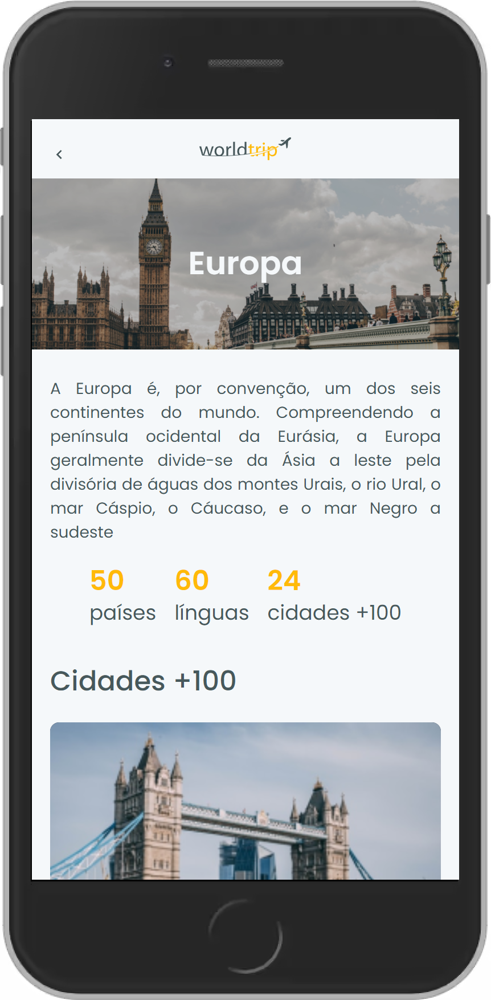

<h1 align="center">
  </img>
</h1>

<p align="center">
  <a href="#ℹ-descrição">Descrição</a> •
  <a href="#-tecnologias">Tecnologias</a> •
  <a href="#-pré-requisitos">Pré-requisitos</a> •
  <a href="#-como-usar">Como usar</a> •
  <a href="#-espiadinha">Espiadinha</a>
</p>

<p align="center">
  </img>
</p>

## ℹ Descrição

Projeto desenvolvido como desafio complementar do capítulo 4 do Ignite. 👨‍🚀🚀

O desafio consistia de dois objetivos principais: (1) desenvolver toda a interface da aplicação e (2) a responsividade das páginas para mobile, utilizando o [_Chakra UI_](https://chakra-ui.com/) como base. Um ponto muito importante desse desafio é a implementação da interface a partir de um [layout do _Figma_](https://www.figma.com/file/HO5CTDie3qpcKoO74gqhyR/Desafio-1-M%C3%B3dulo-4-ReactJS), como se tivesse recebido isso das mãos de um designer. Ademais, foi implementado outras funcionalidades adicionais como:

- Fake API com Mirage;
- Fetch e cache dos dados do servidor com React Query; e
- Feedback mostrando se os dados estão carregando ou se houve erro.

## ⚒ Tecnologias

- [**React**](https://pt-br.reactjs.org)
- [**Typescript**](https://www.typescriptlang.org)
- [**Next.js**](https://nextjs.org)
- [**Chakra UI**](https://chakra-ui.com/)
- [**Swiper**](https://swiperjs.com/)
- [**MirageJS**](https://miragejs.com/)
- [**React Query**](https://react-query.tanstack.com/)

## ⚙ Pré-requisitos

- [Git](https://git-scm.com)
- [Yarn](https://yarnpkg.com)
- Editor de código.

## 🖥 Como usar

**Clone o projeto e acesse a pasta**

```bash
$ git clone https://github.com/EduardoReisUX/world-trip.git && cd world-trip
```

**Siga os passos seguintes**

```bash
# Instale as dependências
$ yarn

# Rode a aplicação
$ yarn dev
```

## 👀 Espiadinha

<p align="center">
</img>
</img>
</p>

---

<p align="center">Feito com 💜 por <a href="https://github.com/EduardoReisUX">Eduardo dos Reis</a></p>
